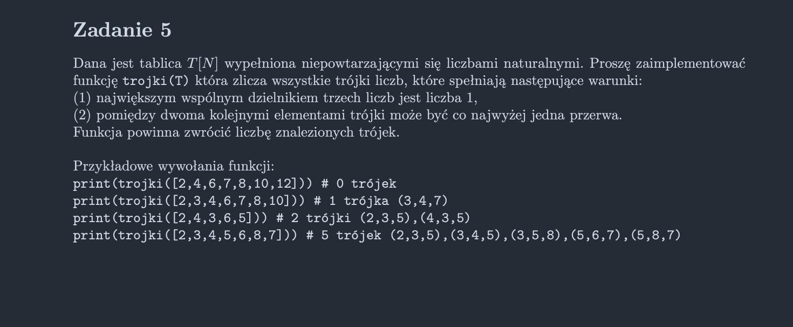

<picture>
  <source srcset="../../../srt/zbior_zadan/2020_5.png" media="(prefers-color-scheme: light)">
  <source srcset="../../../srt/zbior_zadan/black_2020_5.png" media="(prefers-color-scheme: dark)">
  
</picture>

```python
def gcd(a, b):
    while b != 0:
        a, b = b, a % b

    return a


def check(a, b, c):
    # return gcd(gcd(a, b), c) == 1
    return gcd(a, b) == 1 and gcd(b, c) == 1 and gcd(a, c) == 1
    # w ten sposób przechodzą testy z polecenia, więc wnioskuję, że chodzi o liczby parami względnie pierwsze


def rek(t, i, n1, n2, n3, last_i, counter):
    if n1 != 0 and n2 != 0 and n3 != 0:
        if check(n1, n2, n3):
            # print(n1, n2, n3)
            return counter + 1
        return counter
    if i == len(t):
        return counter
    if last_i >= 0 and i - last_i > 2:
        if check(n1, n2, t[i]):
            # print(n1, n2, n3)
            return counter + 1
        return counter

    counter = rek(t, i + 1, n2, n3, t[i], i, counter)
    counter = rek(t, i + 1, n1, n2, n3, last_i, counter)

    return counter


def trojki(T):
    return rek(T, 0, 0, 0, 0, -1, 0)
```


---
Jeśli kod był pomocny, zostaw gwiazdkę 🚀
