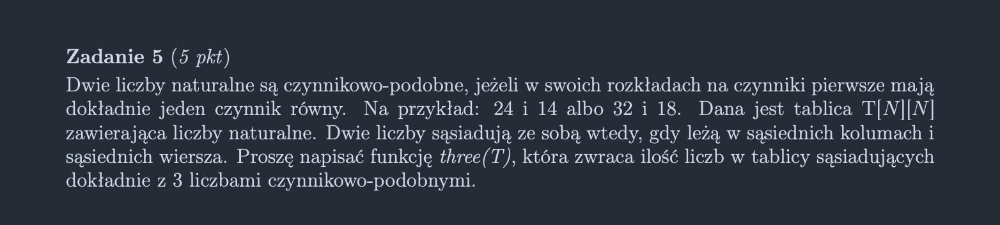

<picture>
  <source srcset="../../../srt/zbior_zadan/2021_5.png" media="(prefers-color-scheme: light)">
  <source srcset="../../../srt/zbior_zadan/black_2021_5.png" media="(prefers-color-scheme: dark)">
  
</picture>

```python
# https://github.com/pawlowiczf/WDI-2023/blob/main/WDI%20zestaw%207/Kolokwia/3_2022.py
def czynnikowo_podobne(a,b):
    n = 2
    counter = 0

    while a > 1:
        flag = False

        while a % n == 0:
            a = a // n
            flag = True 

        if flag and b % n == 0:
            counter += 1 
        #end if
        n += 1 
    #end while
    return counter == 1
#end def 


def three(T):

    result = 0

    for y in range(1, len(T) - 1):
        for x in range(1, len(T) - 1):
            tmp = 0

            if czynnikowo_podobne( T[y][x], T[y-1][x-1] ): tmp += 1
            if czynnikowo_podobne( T[y][x], T[y-1][x+1] ): tmp += 1
            if czynnikowo_podobne( T[y][x], T[y+1][x-1] ): tmp += 1
            if czynnikowo_podobne( T[y][x], T[y+1][x+1] ): tmp += 1

            if tmp == 3: result += 1
        #end for 2
    #end for 1
    return result 
```


---
### Sprawdź też moje inne projekty z odpowiedziami:
- [Rosnotes-Dyskretna](https://github.com/kamilGie/Rosnotes-Dyskretna)
