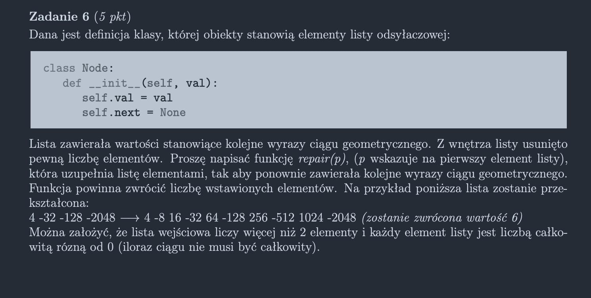

<picture>
  <source srcset="../../../srt/zbior_zadan/2021_6.png" media="(prefers-color-scheme: light)">
  <source srcset="../../../srt/zbior_zadan/black_2021_6.png" media="(prefers-color-scheme: dark)">
  
</picture>


```python
class Node:
    def __init__(self, val, next=None):
        self.val = val
        self.next = next


def is_repairable(head, step):
    current_val = head.val
    while head.next:
        current_val *= step
        if current_val == head.next.val:  # Jeśli osiągnąłem wartość następnego elementu, przechodzę do niego
            head = head.next
        elif abs(step) > 1 and abs(current_val) > abs(head.next.val):  # Sprawdzam, czy przekroczyłem ciąg rosnący
            return False
        elif abs(step) < 1 and abs(current_val) < abs(head.next.val):  # Sprawdzam, czy przekroczyłem ciąg malejący
            return False
    return True


def repair(node):
    first_q = abs(node.next.val / node.val)  # Iloraz dwóch pierwszych elementów
    divisor = 1  # Liczba kroków potrzebnych do przejścia od pierwszego do drugiego elementu
    q = first_q

    # Docelowy krok iloczynu będzie ilorazem dwóch pierwszych elementów,
    # spierwiastkowanym do odpowiedniej potęgi w zależności od liczby kroków, pomiędzy 1 a 2 elementem.
    while not is_repairable(node, q) and not is_repairable(node, -q):  # Dopóki krok nie naprawia ciągu
        divisor += 1
        q = first_q ** (1 / divisor)  # Krok to pierwiastek stopnia równego liczbie kroków

    q = -q if is_repairable(node, -q) else q  # Jeśli poprawny krok jest ujemny, zmieniam na wartość ujemną

    inserted_count = 0
    while node.next:
        if node.val * q != node.next.val:  # Jeśli nie dotarłem do wartości następnego elementu w ciągu
            node.next = Node(node.val * q, node.next)  # Dodaję brakujący element do listy
            inserted_count += 1
        node = node.next
    return inserted_count
```

Precyzyjne rozwiązanie eliminujące problemy związane z zaokrąglaniem liczb zmiennoprzecinkowych w \Rozwiązania\precyzyjne.py


---
### Sprawdź też moje inne projekty z odpowiedziami:
- [Rosnotes-Dyskretna](https://github.com/kamilGie/Rosnotes-Dyskretna)
