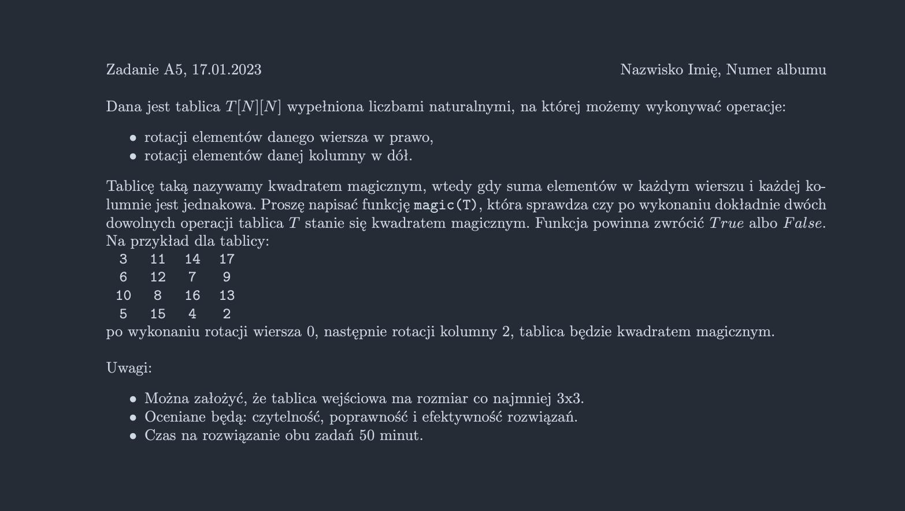

<picture>
  <source srcset="../../../srt/zbior_zadan/2022_A5.png" media="(prefers-color-scheme: light)">
  <source srcset="../../../srt/zbior_zadan/black_2022_A5.png" media="(prefers-color-scheme: dark)">
  
</picture>

```python
def rotate_right(T, idx):
    n = len(T)
    last = T[idx][-1]
    for i in range(n - 1, 0, -1):
        T[idx][i] = T[idx][i - 1]
    T[idx][0] = last


def rotate_down(T, idx):
    n = len(T)
    last = T[-1][idx]
    for i in range(n - 1, 0, -1):
        T[i][idx] = T[i - 1][idx]
    T[0][idx] = last


def is_magic(T):
    n = len(T)
    target_sum_row = sum(T[0])
    target_sum_col = sum(T[i][0] for i in range(n))  # Suma pierwszej kolumny

    for i in range(n):
        row_sum = 0
        col_sum = 0
        for j in range(n):
            row_sum += T[i][j]  # Suma wiersza
            col_sum += T[j][i]  # Suma kolumny
        if row_sum != target_sum_row or col_sum != target_sum_col:
            return False

    return True


def magic(T):
    n = len(T)
    operations = [  # możliwy dobór kombinacji
        (rotate_right, rotate_right),
        (rotate_right, rotate_down),
        (rotate_down, rotate_right),
        (rotate_down, rotate_down),
    ]

    for i in range(n):
        for j in range(n):
            for op1, op2 in operations:
                T_copy = [row[:] for row in T]  # Głębokie kopiowanie tablicy
                op1(T_copy, i)
                op2(T_copy, j)
                if is_magic(T_copy):
                    return True

    return False

```


