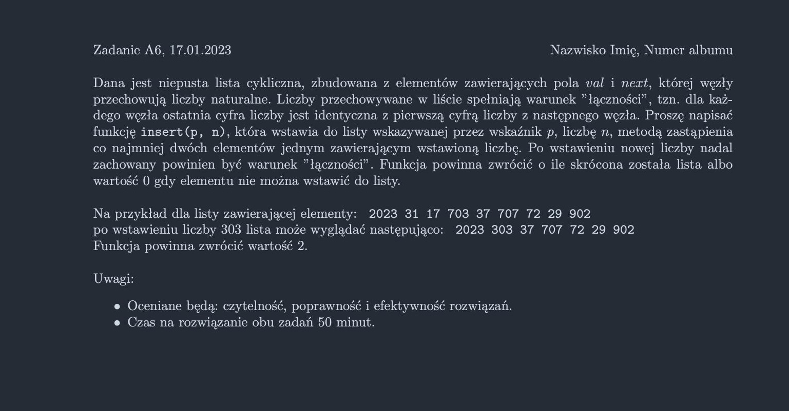

<picture>
  <source srcset="../../../srt/zbior_zadan/2022_A6.png" media="(prefers-color-scheme: light)">
  <source srcset="../../../srt/zbior_zadan/black_2022_A6.jpeg" media="(prefers-color-scheme: dark)">
  
</picture>

```python
class Node:
    def __init__(self, val, next=None):
        self.val = val
        self.next = next


def first_digit(x):
    while x >= 10:
        x //= 10
    return x


def last_digit(x):
    return x % 10


def insert(p, n):
    head = p

    while True:
        # Szukamy początku (gdzie ostatnia cyfra zgadza się z pierwszą cyfrą n)
        if last_digit(head.val) == first_digit(n):
            start = head
            current = start.next
            length = 0

            # Szukamy końca (gdzie pierwsza cyfra zgadza się z ostatnią cyfrą n)
            while current != start:
                if first_digit(current.val) == last_digit(n):
                    # Jeśli długość > 2, wstawiamy i zwracamy długość
                    if length >= 2:
                        start.next = Node(n, current)
                        return length - 1  # minus koniec ktorego nie usuwamy oraz ona sama
                current = current.next
                length += 1

        head = head.next
        if head == p:  # Jeśli wróciliśmy do początku listy, kończymy
            break

    return 0
```


---
Jeśli repo się podoba, zostaw gwiazdkę 👍
