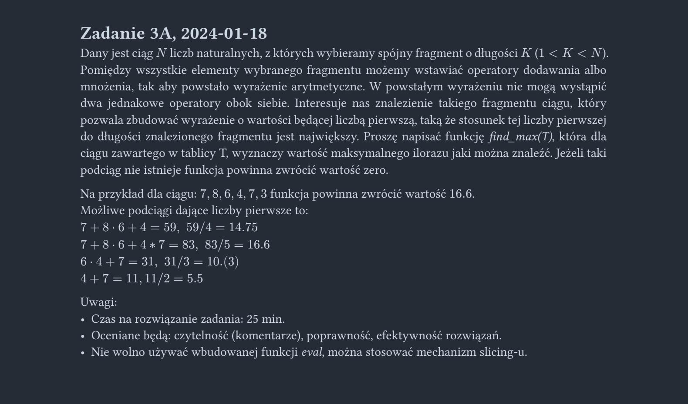

<picture>
  <source srcset="../../../srt/zbior_zadan/2023_3A.png" media="(prefers-color-scheme: light)">
  <source srcset="../../../srt/zbior_zadan/black_2023_3A.png" media="(prefers-color-scheme: dark)">
  
</picture>

```python
# Autor rozwiązania Piotr Polański
from math import sqrt


def is_prime(n):
    if n < 2:
        return False
    if n == 2:  # do tego momentu eliminujemy l. parzyste
        return True
    if n % 2 == 0:
        return False
    d = 3
    s = sqrt(n)
    while d <= s:
        if n % d == 0:
            return False
        d += 2
    return True


def best(T):  # zwraca wyższy pierwszy wynik spośród 2 rozważanych przypadków
    l = len(T)
    case_one = T[0]
    d = 1
    while d < l:  # Działanie rozpoczęte dodawaniem: A + B * C + D...
        if d + 1 < l:
            case_one += T[d] * T[d + 1]
            d += 2
        if d + 1 == l:
            case_one += T[d]
            d += 1
    case_two = T[0] * T[1]
    d = 2
    while d < l:  # Działanie rozpoczęte mnożeniem: A * B + C * D...
        if d + 1 == l:
            case_two += T[d]
            d += 1
        if d + 1 < l:
            case_two += T[d] * T[d + 1]
            d += 2
    if not is_prime(
        case_one
    ):  # jeśli niepierwsze, zerujemy je. 0 oznacza że nie ma szans "wygrać" w funkcji (max)
        case_one = 0
    if not is_prime(case_two):
        case_two = 0
    return max(case_one, case_two)


def Zadanie_3A(T):
    l = len(T)
    out = 0
    for i in range(l - 1):  # min dł. podciągu 2
        for j in range(
            i + 1, l
        ):  # sprawdza wszystkie podciągi o danym początku i końcu
            val = (
                best(T[i : j + 1]) / (j - i + 1) if (j - i + 1) != l else 0
            )  # warunek na wypadek gdyby podciąg == ciąg. Dzielnik wyznaczamy z indeksów
            out = max(out, val)  # najwyższa wartość
    return out
```


---
### Sprawdź też moje inne projekty z odpowiedziami:
- [Rosnotes-Dyskretna](https://github.com/kamilGie/Rosnotes-Dyskretna) - Premiera wkrótce
- [Rosnotes-WDI](https://github.com/kamilGie/Rosnotes-WDI) - Premiera wkrótce
- [ASRT-ASD](https://github.com/kamilGie/Rosnotes-Dyskretna) - Premiera wkrótce
