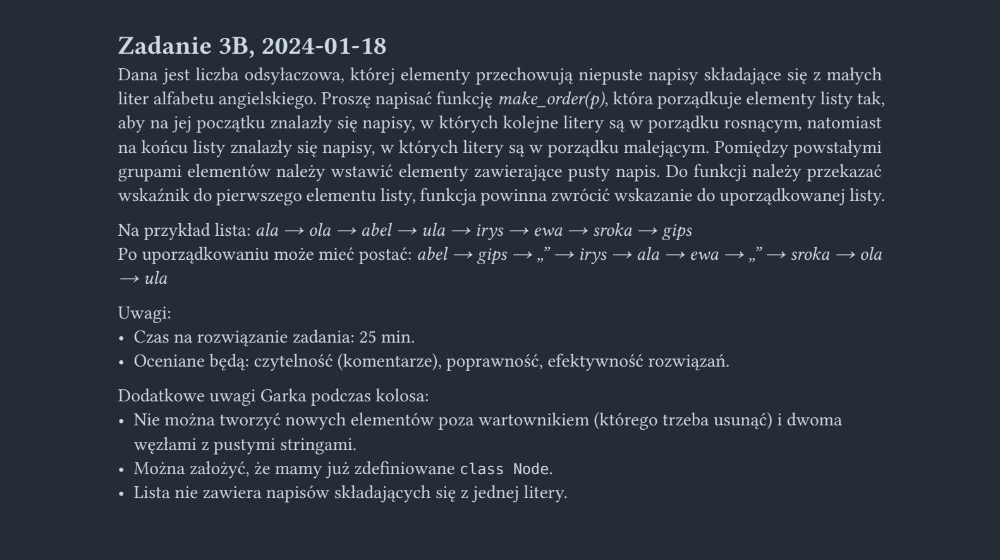

<picture>
  <source srcset="../../../srt/zbior_zadan/2023_3B.png" media="(prefers-color-scheme: light)">
  <source srcset="../../../srt/zbior_zadan/black_2023_3B.png" media="(prefers-color-scheme: dark)">
  
</picture>

```python

# Na Podstawie rozwiązania Piotra Polańskiego
class Node:
    def __init__(self, val, next=None):
        self.val = val
        self.next = next


def sprawdz_wariant(val):
    """Zwraca 0, jeśli napis jest rosnący; 1, jeśli nijaki; 2, jeśli malejący."""
    czy_rosnacy, czy_malejacy = True, True # Flagi sprawdzające czy napis utrzymuję sie jako rosnący lub malejący
    for i in range(len(val)-1): # Przechodzę przez caly napis
        if val[i] < val[i + 1] and czy_rosnacy: # Sprawdzam czy napis rośnię jak tak to juz nie może byc malejący
            czy_malejacy = False
        elif val[i] > val[i + 1] and czy_malejacy: # Sprawdzam czy napis maleje jak tak to już nie może być rosnący
            czy_rosnacy = False
        else: # Skoro napis kiedyś nie rósł i kiedyś nie malał albo jest równy to znaczy że jest nijaki
            return 1
    return 0 if czy_rosnacy else 2


def make_order(p) -> Node:
    # Tworzenie list pomocniczych z wartownikiem i separatorami odrazu polączone
    malejacy = Node("")
    nijaki = Node("", malejacy)
    rosnacy = Node(None, nijaki)

    while p:
        next_p = p.next # Zapamiętuje następny element by móc odłączyć łańcuch
        wariant = sprawdz_wariant(p.val) # 0 wartość rosnie 1 wartość nijaka 2 wartość maleje
        if wariant == 0:
            p.next = rosnacy.next # Dodaje po wartowniku
            rosnacy.next = p
        elif wariant == 1:
            p.next = nijaki.next # Dodaje po separatorze
            nijaki.next = p
        else:
            p.next = malejacy.next # Dodaje po separatorze
            malejacy.next = p

        p = next_p

    return rosnacy.next # Usuwam wartownika
```


---
Jeśli kod był pomocny, zostaw gwiazdkę 🤝
