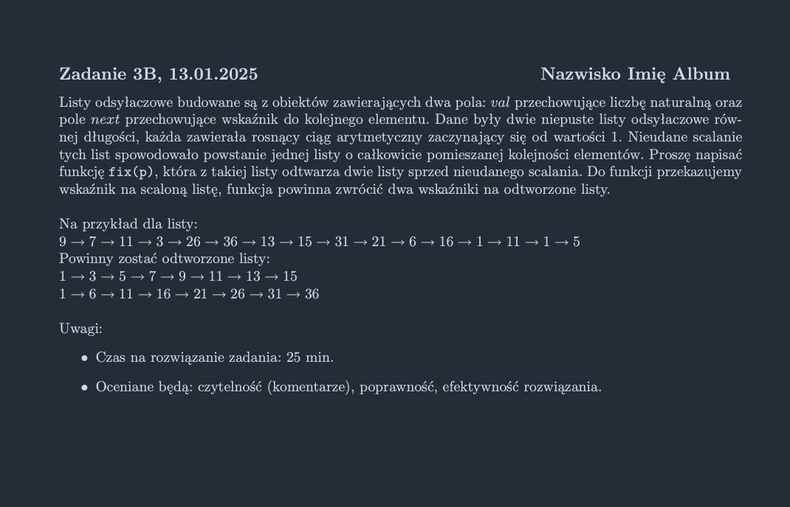

<picture>
  <source srcset="../../../srt/zbior_zadan/2024_3B.png" media="(prefers-color-scheme: light)">
  <source srcset="../../../srt/zbior_zadan/black_2024_3B.png" media="(prefers-color-scheme: dark)">
  
</picture>

```python
class Node:
    def __init__(self, val, next=None):
        self.val = val
        self.next = next


def bubble_sort(head):
    """ sortuje liste buuble sortem"""
    current = head
    while current:
        next_node = head
        while next_node.next:
            if next_node.val > next_node.next.val:
                next_node.val, next_node.next.val = next_node.next.val, next_node.val
            next_node = next_node.next
        current = current.next

    return head


def fix(p):
    """Posortuję listę, a następnie wyłączę z niej elementy drugiego ciągu, tworząc osobną listę. Na końcu zwrócę obie listy."""
    # Sortuję listę, aby łatwiej wyznaczyć elementy ciągu
    sorted_list = bubble_sort(p)

    # W posortowanej liście ciąg o mniejszym kroku (r) znajduje się między 1. lub 2. a 3. elementem
    target_value = 1
    step = sorted_list.next.next.val - sorted_list.val
    new_list_head = new_list_tail = Node(None)

    # Odlączając elemety 1 listy z listy zostanie mi 2 ciąg gotowy do zwrócenia
    prev, curr = sorted_list, sorted_list.next
    while curr:
        if curr.val == target_value:  # Jeśli to element pierwszego ciągu
            # Przenoszę go do nowej listy
            new_list_tail.next = curr
            new_list_tail = new_list_tail.next
            # Usuwam element z oryginalnej listy
            prev.next = curr.next
            curr.next = None
            # Zwiększam wartość kolejnego oczekiwanego elementu w ciągu
            target_value += step
            curr = prev.next
        else:  # Jeśli to nie jest element pierwszego ciągu
            prev, curr = curr, curr.next

    return sorted_list, new_list_head.next
```

---
### Sprawdź też moje inne projekty z odpowiedziami:
- [Rosnotes-Dyskretna](https://github.com/kamilGie/Rosnotes-Dyskretna)
- [Rosnotes-WDI](https://github.com/kamilGie/Rosnotes-WDI) - Premiera wkrótce
- [ASRT-ASD](https://github.com/kamilGie/ASRT-ASD) - Premiera wkrótce
